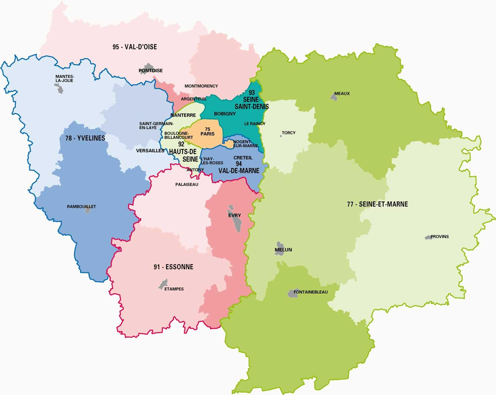

# Île-de-France demand data conversion for `URB`

<p align="center">
  
</p>


This repository is dedicated to generating input data for use with [URB](https://github.com/COeXISTENCE-PROJECT/URB).

## Contents

- Raw synthetic demand data ([inner_trips/](/inner_trips/)) for inner-subregional trips in Île-de-France. Also available on [Kaggle](https://www.kaggle.com/datasets/ukaszgorczyca/urb-inner-trips).
- Script ([process_files.py](/process_files.py)) for converting this data into:
    - Network files compatible with `SUMO`.
    - Demand data compatible with `URB` and `RouteRL`.
- Resulting converted files organized into individual network folders, also provided with network captures. Also available on [Kaggle](https://www.kaggle.com/datasets/ukaszgorczyca/urb-networks).

## Usage

```bash
python3 process_files.py --region <region_name> --min-start <min_start_time> --max-start <max_start_time> --num-paths <num_paths>
```

where:
- ```<region_name>``` is the region name key (e.g., region_1), corresponds to a `.csv` file from [inner_trips/](/inner_trips/).
- ```<min_start_time>``` is the earliest departure time desired in the resulting demand data, in seconds (default: 9*3600).
- ```<max_start_time>``` is the latest departure time desired in the resulting demand data, in seconds (default: 9.5*3600).
- ```<num_paths>``` is the number of paths to try generating between each origin-destination pair. Used to filter out paths which are not suitable for route choice (default: 4).
